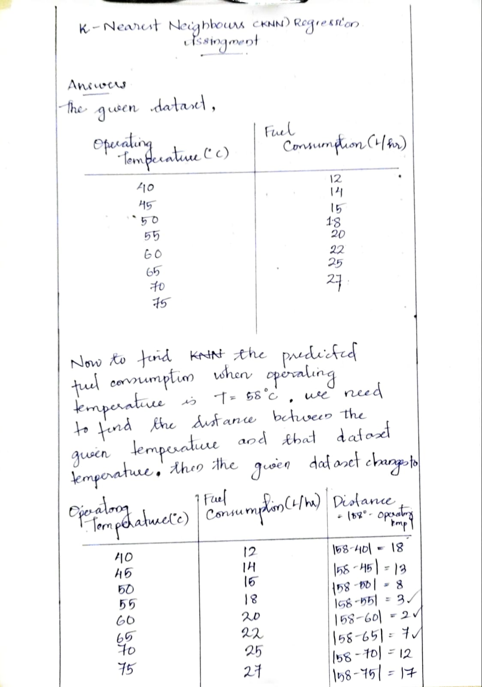
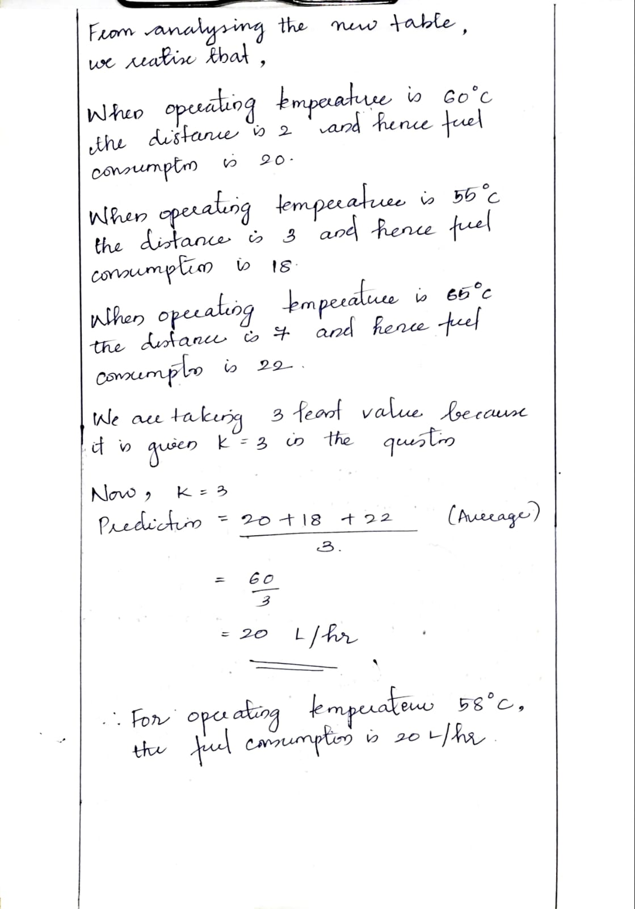
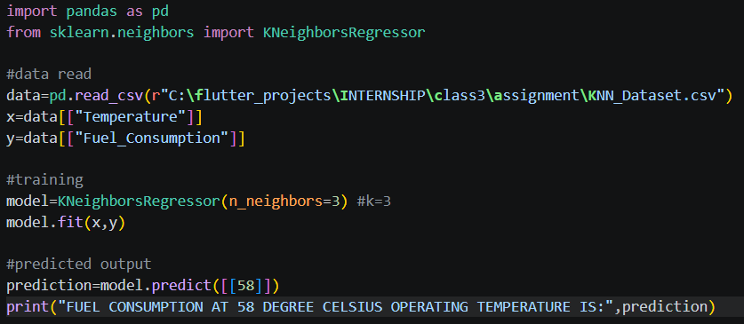
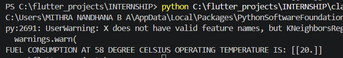

# Assignment3-KNN-Regression
Assignment 3 about KNN Regression by Mithra Nandhana B A

## Problem Statement
An industrial machine operates under different temperature conditions, and its fuel consumption varies accordingly. The following dataset shows the relationship
between the machine’s operating temperature and its fuel consumption.

## Answer
Below,
1. The fuel consumption when the operating temperature is 58 degree celsius using KNN with necessary calculations and steps
   
*check out the whole pdf:* `assignment3-KNN-Regression/numerical/assignment3.pdf/`

And, implementation of the same is done using python. The code is saved in the `assignment3-KNN-Regression/assignment/` along with the csv file containing the data and the code.

The code and the output along with graph are given below.

## *Code*

## *Output*

## Final Answer
By using the KNN Regression Model when K=3,  
when 58 degree celsius Operating Temperature, the respective fuel consumption is 20 L/hr.

# What I Learned
By this assignment and class, I learned:
1. KNN Regression Model
2. SVD 
3. MSE,RMSE

:D
